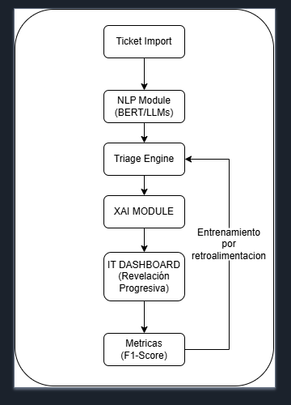
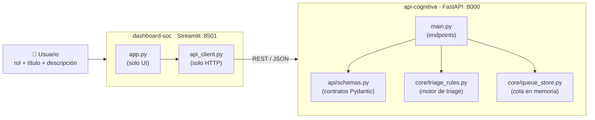

# 🛡️ SOC-XAI · Triage Semántico de Tickets con IA Explicable

Sistema que **prioriza automáticamente** los tickets de TI y Seguridad (nivel 1 a 5) y **explica por qué** asignó cada prioridad, para combatir la *fatiga de alertas* en los Centros de Operaciones de Seguridad (SOC).

> **Estado:** ✅ Entrega 1 de 4 completada: flujo end-to-end, contratos validados, tests automatizados y dataset etiquetado.
> Ver el roadmap completo en [`plan-entregas.md`](plan-entregas.md).

**Equipo:** Carlos Felipe Jiménez Sposito · David Santiago Castro Sierra · Roger Mauricio Durán Guacaneme
Escuela Colombiana de Ingeniería Julio Garavito: Facultad de Ingeniería de Sistemas

---

## 📌 El problema

- Un SOC recibe en promedio **~3.000 alertas diarias**, y cerca del **63 % queda sin atender** a tiempo (Vectra AI, 2026).
- El **73 %** de los equipos de seguridad considera los falsos positivos su principal problema (SANS, 2025).
- Para el usuario final, la frontera entre *"mi equipo está lento"* y *"tengo ransomware"* es difusa: hace falta **entender el lenguaje** del ticket.
- Los analistas **no confían** en prioridades de una "caja negra": la explicación es un requisito para que el sistema se adopte (Rastogi et al., CCS 2025).

**Propuesta:** NLP para clasificar el ticket + XAI (LIME/SHAP) para justificar la decisión + un dashboard de **revelación progresiva** (primero la prioridad; la explicación, bajo demanda).

---

## 🏗️ Arquitectura

<p align="center"></p>

Implementación actual (Entrega 1):



| Servicio | Tecnología | Puerto | Responsabilidad |
|----------|-----------|--------|-----------------|
| `api-cognitiva` | Python 3.10 · FastAPI · Pydantic v2 | 8000 | Validar, clasificar, explicar y encolar tickets |
| `dashboard-soc` | Python 3.10 · Streamlit · Plotly | 8501 | Formulario de ingreso y cola de TI |

Los dos servicios corren en contenedores Docker sobre una red privada (`soc_network`). El frontend **nunca** contiene lógica de negocio: todo pasa por la API.

---

## ✨ Qué incluye la Entrega 1

**Para el usuario que reporta**
- Formulario con **Rango/Rol**, **Título** y **Descripción**. Los roles vienen del backend, no están copiados en el frontend.
- Validación inmediata en pantalla, y mensajes claros si el backend rechaza el ticket o está caído.

**Para el analista de TI**
- **Cola única y compartida**: todos los navegadores ven la misma cola, servida por el backend.
- Orden automático por prioridad descendente. En los empates, el ticket más antiguo va primero (FIFO).
- Tarjetas con semáforo 🔴 CRÍTICO · 🟠 ALTO · 🟡 MEDIO · 🟢 BAJO, rol, fecha en hora de Bogotá y descripción.
- Botón **"¿Por qué esta prioridad?"**: muestra un gráfico de los factores que la decidieron (peso del rol y palabras clave detectadas).

**Motor de triage (heurística de la Semana 1)**
- `prioridad = min(5, peso_del_rol + bonus_por_palabras_clave)`
- Analiza **título + descripción** y detecta **palabras completas**: *antivirus* no cuenta como *virus*.
- Normaliza mayúsculas y tildes: *CONTRASEÑA* = *contraseña* = *contrasena*.
- Detecta **extensiones de ransomware** (`informe.lock`, `.encrypted`, `.crypt`…).

---

## 💡 Valor técnico agregado

| Decisión | Por qué importa |
|----------|-----------------|
| **Contratos Pydantic estrictos** (`Enum` de roles, `str_strip_whitespace`, límites de longitud) | Una entrada inválida devuelve **422 con un mensaje claro**, nunca un 500. Un texto de solo espacios o un rol inventado no llegan a la lógica |
| **Contrato XAI desde el día 1** (`explicacion_xai: {factor: peso}`) | El dashboard ya dibuja explicaciones. En la Semana 3 LIME reemplaza la fuente de los pesos **sin cambiar el frontend** |
| **Arquitectura por capas** (`main.py` delgado → `core/`) | El motor de triage se prueba sin HTTP y se puede reemplazar por el modelo de ML de la Semana 2 tocando un solo archivo |
| **Endpoints `def` (no `async def`)** | FastAPI los ejecuta en un pool de hilos: un modelo pesado no bloqueará el servidor |
| **`id` UUID + `creado_en` en UTC** | Base para borrar, hacer override y auditar tickets (Semanas 2–4). Las fechas son inequívocas entre zonas horarias |
| **El texto del usuario se muestra escapado** | Un ticket con `[clic aquí](http://sitio-malo)` **no** se convierte en un enlace clicable dentro del SOC (protección contra phishing interno) |
| **Sin datos simulados cuando el backend falla** | Los errores se ven, no se esconden. El usuario recibe un estado claro y el botón se deshabilita |
| **9 tests automatizados** (unitarios + integración) | Cada bug encontrado en la revisión quedó cubierto por un test de regresión |
| **Dataset propio de 150 tickets con guía de etiquetado** | Permite entrenar y **medir** de verdad. Incluye un 21 % de tickets ambiguos y pares "trampa" para detectar **sesgo por cargo** |

### 📊 Línea base medida

La heurística de la Entrega 1 se evaluó contra el dataset etiquetado:

| Métrica | Heurística (Semana 1) |
|---------|----------------------|
| Exactitud | **24 %** (azar = 20 %) |
| Error medio | 1.54 niveles |
| Trampas de sesgo sobre-priorizadas (≥ 2 niveles) | 12 |

**Conclusión:** buscar palabras clave y sumar el peso del cargo **no alcanza**. Falla con tickets mal escritos (*"todo se bloqueó y salió un contador"*) y prioriza de más lo que reporta un directivo, aunque sea trivial. Este número es la **línea base** que el modelo entrenado de la Semana 2 debe superar.

---

## 🚀 Guía paso a paso: ejecutar y probar el proyecto

Todo se hace **desde la raíz del repositorio y solo con Docker**. No hace falta instalar Python, crear entornos virtuales ni entrar a las carpetas `backend/` o `frontend/`.

### 1. Requisitos

| Herramienta | Versión | Comprobar |
|-------------|---------|-----------|
| Docker Engine / Docker Desktop | 24+ | `docker --version` |
| Docker Compose (plugin v2) | 2.20+ | `docker compose version` |
| Git | cualquiera | `git --version` |

Puertos libres: **8000** y **8501**.

### 2. Clonar

```bash
git clone <url-del-repositorio> semantic-ticket-triage
cd semantic-ticket-triage
```

### 3. Construir y levantar

```bash
docker compose up --build -d
```

> ⏱️ **La primera vez tarda** (10–30 min según la conexión), porque la imagen del backend descarga PyTorch y Transformers para las próximas entregas. Las siguientes veces arranca en segundos gracias a la caché de Docker.

### 4. Verificar que los servicios arrancaron

```bash
docker compose ps
docker compose logs --tail 5 api-cognitiva
```

✅ Ambos servicios aparecen como `Up`, y el log del backend termina en `Application startup complete.`

### 5. Probar la API

**Opción A: Swagger (navegador, funciona en cualquier sistema operativo).**
Abre **http://localhost:8000/docs** → `POST /api/triage` → *Try it out* → pega esto y pulsa *Execute*:

```json
{
  "titulo": "Archivos con extensión .lock",
  "texto": "Ningún archivo abre y todos terminan en informe.lock",
  "rol_usuario": "Gerente / Director"
}
```

**Opción B: terminal (Linux / macOS / Git Bash).**

```bash
# Roles válidos
curl -s localhost:8000/api/roles

# Ticket crítico → prioridad 5, CRÍTICO
curl -s -X POST localhost:8000/api/triage -H "Content-Type: application/json" \
  -d '{"titulo":"Archivos con extensión .lock","texto":"Ningún archivo abre y todos terminan en informe.lock","rol_usuario":"Gerente / Director"}'

# Validación: rol inventado → 422 (no 500)
curl -s -o /dev/null -w "%{http_code}\n" -X POST localhost:8000/api/triage -H "Content-Type: application/json" \
  -d '{"titulo":"Hola mundo","texto":"Necesito ayuda por favor","rol_usuario":"Rey del Universo"}'

# Cola ordenada
curl -s localhost:8000/api/queue
```

### 6. Probar el dashboard: guion de demo

Abre **http://localhost:8501** y envía estos tickets desde el panel lateral:

| # | Rol | Título | Descripción | Resultado esperado |
|---|-----|--------|-------------|--------------------|
| 1 | Empleado General | `Solicitud de mouse nuevo` | `La rueda de mi mouse ya no gira bien` | 🟢 BAJO · 1 |
| 2 | CEO / Alta Dirección | `RANSOMWARE en mi equipo` | `Todos los archivos terminan en informe.lock` | 🔴 CRÍTICO · 5. Sube por encima de los tickets de menor prioridad |
| 3 | Analista / Contable | `Olvidé la contraseña` | `No recuerdo mi CONTRASEÑA del correo` | 🟡 MEDIO · 3 (detecta *contraseña* aunque esté en mayúsculas) |
| 4 | Empleado General | `VPN` | `No conecta` | ❌ Error de validación en pantalla; no se envía |
| 5 | CEO / Alta Dirección | `Cambiar fondo de pantalla` | `Quiero el logo nuevo como fondo` | 🔴 5. ⚠️ **Sesgo por cargo conocido** de la heurística, que se corrige en la Semana 2 |

En cada tarjeta, abre **"¿Por qué esta prioridad?"** para ver qué factores pesaron.

> Prueba de robustez: detén el backend con `docker compose stop api-cognitiva` y recarga el dashboard. Debe mostrar *"Backend no disponible"* sin romperse. Vuelve a encenderlo con `docker compose start api-cognitiva`.

### 7. Ejecutar los tests automatizados

Los tests corren **dentro del contenedor**, con el mismo Python 3.10 de producción:

```bash
docker compose exec api-cognitiva pip install -r requirements-dev.txt   # solo la primera vez
docker compose exec api-cognitiva pytest -v
```

✅ Resultado esperado: `9 passed`.

### 8. Validar el dataset

```bash
docker run --rm -v "$PWD/evaluation:/evaluation" python:3.10-slim python /evaluation/validate_dataset.py
```

(Si tienes Python 3.8+ instalado, también sirve `python3 evaluation/validate_dataset.py`.)

✅ Resultado esperado: tabla de distribución y `✅ Dataset válido según GUIA_ETIQUETADO.md`.

### 9. Apagar

```bash
docker compose down        # detiene y elimina los contenedores (la caché de modelos se conserva)
```

### 🩺 Solución de problemas

| Síntoma | Causa probable | Qué hacer |
|---------|----------------|-----------|
| `curl` o el navegador se quedan esperando, sin respuesta | El backend falló al importar el código (el contenedor sigue `Up`) | `docker compose logs api-cognitiva` y busca el `Traceback` |
| `port is already allocated` | Otro programa usa el 8000 o el 8501 | Libera el puerto o cambia el mapeo en `docker-compose.yml` |
| El dashboard dice *"Backend no disponible"* | El backend no está corriendo | `docker compose ps` → `docker compose up -d api-cognitiva` |
| Los tickets desaparecieron | La cola vive en memoria y se reinicia con el backend | Comportamiento esperado en el MVP (ver *Limitaciones*) |
| `pytest: not found` | Faltan las dependencias de desarrollo en el contenedor | Repite el primer comando del paso 7 |

---

## 📡 API REST

Documentación interactiva: **http://localhost:8000/docs** (Swagger) · **http://localhost:8000/redoc**

| Método | Endpoint | Descripción | Respuestas |
|--------|----------|-------------|------------|
| `GET` | `/api/roles` | Lista oficial de roles aceptados | 200 |
| `POST` | `/api/triage` | Clasifica un ticket, lo encola y lo devuelve con su explicación | 200 · 422 |
| `GET` | `/api/queue` | Cola ordenada por prioridad (desc.) y orden de llegada | 200 |

<details>
<summary>Ejemplo de respuesta de <code>POST /api/triage</code></summary>

```json
{
  "id": "b8104752-f83e-466f-aaca-24d430afb6c1",
  "titulo": "RANSOMWARE en mi equipo",
  "creado_en": "2026-10-03T02:55:23.521266Z",
  "nivel_prioridad_texto": "ALTO",
  "prioridad": 4,
  "texto": "No abre ningún archivo, todos terminan en informe.lock",
  "rol_usuario": "Analista / Contable",
  "explicacion_xai": {
    "rol: Analista / Contable": 2.0,
    "ransomware": 2.0,
    ".lock": 2.0
  }
}
```
</details>

**Reglas de validación de `POST /api/triage`**

| Campo | Regla |
|-------|-------|
| `titulo` | 5–100 caracteres (sin contar espacios en los extremos) |
| `texto` | 10–2000 caracteres (sin contar espacios en los extremos) |
| `rol_usuario` | Exactamente uno de los valores de `GET /api/roles` |

---

## 🧪 Pruebas automatizadas

`backend/tests/test_triage.py`:

| Test | Qué protege |
|------|-------------|
| `test_antivirus_no_cuenta_como_virus` | Detección por palabra completa, no por subcadena |
| `test_rol_invalido_devuelve_422` | Validación del `Enum` de roles |
| `test_texto_en_blanco_devuelve_422` | Un texto de solo espacios no provoca un error 500 |
| `test_palabra_critica_en_titulo` | El título también se analiza |
| `test_extension_lock_es_critica` | Detección de extensiones de ransomware |
| `test_sin_tildes_detecta_contrasena` | Normalización de tildes y mayúsculas |
| `test_cola_ordenada_por_prioridad` | Lo más crítico va primero |
| `test_empate_respeta_orden_de_llegada` | FIFO en empates |
| `test_roles_endpoint` | Contrato de `/api/roles` |

---

## 🗂️ Dataset de evaluación

`evaluation/sample_tickets.json`: **150 tickets en español**, etiquetados con [`evaluation/GUIA_ETIQUETADO.md`](evaluation/GUIA_ETIQUETADO.md).

- **Balanceado:** 30 tickets por nivel de prioridad, con los 6 roles representados.
- **Realista:** 21 % de tickets **ambiguos o mal escritos** (*"me salio algo raro"*, *"todo se bloqueo"*), cada uno con una nota que justifica su etiqueta.
- **Regla anti-sesgo:** el rol solo agrava incidentes de **seguridad**. Un CEO que pide cambiar el fondo de pantalla es prioridad 1.
- **Pares de control:** el mismo incidente reportado por roles distintos, para medir cuánto influye el cargo.
- **Vocabulario variado:** el ransomware aparece como *".lock"*, *"nota de rescate"*, *"piden bitcoin"*, *"contador de tiempo"*…, para que un modelo no aprenda una sola palabra.

---

## 📂 Estructura del repositorio

```text
semantic-ticket-triage/
├── docker-compose.yml          # Orquesta api-cognitiva (8000) y dashboard-soc (8501)
├── plan-entregas.md            # Roadmap de 4 semanas, decisiones y riesgos
├── backend/                    # Motor cognitivo (FastAPI)
│   ├── main.py                 # Endpoints REST (capa delgada)
│   ├── api/schemas.py          # Contratos Pydantic: RolUsuario, TicketRequest/Response, QueueResponse
│   ├── core/triage_rules.py    # Motor de triage: normalización, tokenización, heurística
│   ├── core/queue_store.py     # Cola en memoria encapsulada
│   ├── tests/                  # pytest + TestClient
│   ├── requirements.txt        # Dependencias de producción
│   └── requirements-dev.txt    # Dependencias de pruebas
├── frontend/                   # Dashboard del analista (Streamlit)
│   ├── app.py                  # Interfaz: formulario + cola + gráficos
│   └── api_client.py           # Cliente HTTP y manejo de errores del backend
└── evaluation/
    ├── GUIA_ETIQUETADO.md      # Criterio de prioridad 1–5
    ├── sample_tickets.json     # Dataset etiquetado (150 tickets)
    └── validate_dataset.py     # Validador del dataset (solo librería estándar)
```

---

## ⚠️ Limitaciones conocidas (Entrega 1)

- **Heurística, no modelo:** 24 % de exactitud y sesgo por cargo. Se reemplaza en la Semana 2.
- **Cola en memoria:** se pierde al reiniciar el backend. Es aceptable para el MVP.
- **Sin autenticación:** cualquiera puede enviar tickets, por diseño de esta entrega.
- **La explicación actual es de la heurística**, no LIME/SHAP (Semana 3).
- **Las dependencias no tienen versión fija** y la imagen del backend incluye PyTorch con CUDA. Se optimiza en la Semana 2 (tarea 2.9).

---

## 🗺️ Roadmap

| Semana | Entrega | Estado |
|--------|---------|--------|
| 1 | Flujo end-to-end + validación + tests + dataset | ✅ |
| 2 | Modelo entrenado (TF-IDF + Regresión Logística), métricas F1, `/health`, borrar tickets | ⏳ |
| 3 | Explicaciones LIME bajo demanda, palabras resaltadas, estadísticas del turno | ⏳ |
| 4 | Override del analista como feedback, análisis de sesgo, reporte final, demo | ⏳ |

Detalle de las tareas en [`plan-entregas.md`](plan-entregas.md).

---

## 📚 Referencias

- M. T. Ribeiro, S. Singh, C. Guestrin. *"Why should I trust you?" Explaining the predictions of any classifier.* KDD 2016. (LIME)
- S. M. Lundberg, S.-I. Lee. *A unified approach to interpreting model predictions.* NeurIPS 2017. (SHAP)
- N. Rastogi et al. *Too much to trust? Measuring the security and cognitive impacts of explainability in AI-driven SOCs.* CCS 2025.
- SANS Institute. *2025 SANS Detection and Response Survey.*
- Vectra AI. *2026 State of Threat Detection and Response Report.*
