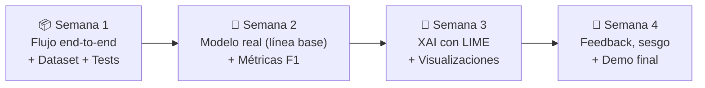

# 🛡️ Plan de Entregas — SOC Triage Semántico con XAI (v2)

> **Proyecto:** Sistema de triage inteligente de tickets de TI/Seguridad con NLP e IA Explicable
> **Stack:** FastAPI · Streamlit · Docker · scikit-learn · Transformers (HuggingFace) · LIME (SHAP opcional)
> **Idioma de los tickets:** Español
> **Modelo de desarrollo:** 4 entregas semanales con funcionalidad incremental

**Leyenda de estados:** ✅ Hecho · 🔧 Hecho, requiere corrección · ⏳ Pendiente · ⭐ Opcional

---

## 🧭 Principios del plan

1. **Nada depende de algo que llega después.** Si el frontend usa un endpoint, ese endpoint se construye en la misma semana o antes.
2. **Los datos van primero.** Sin tickets etiquetados no se puede entrenar, evaluar ni explicar un modelo.
3. **Primero la línea base, después lo sofisticado.** Un modelo simple y rápido (TF-IDF + Regresión Logística) garantiza una entrega funcional; el transformer es una mejora que se compara contra ella.
4. **Cada semana termina con algo demostrable y verificable** (ver "Definición de terminado").
5. **Tests desde la Semana 1.** Cada bug corregido se convierte en un test.

---

## Visión General del Roadmap



### Arquitectura objetivo del backend

```text
backend/
├── main.py                 # Solo endpoints (delgado): valida, llama a core/, responde
├── api/schemas.py          # Contratos Pydantic (request/response)
├── core/
│   ├── triage_rules.py     # S1: heurística (rol + palabras clave)
│   ├── nlp_engine.py       # S2: carga y usa el modelo entrenado
│   ├── xai_engine.py       # S3: explicaciones LIME
│   └── queue_store.py      # Cola en memoria (agregar, listar, borrar, override)
├── training/train_baseline.py  # S2: entrena y guarda el modelo
└── tests/                  # pytest + TestClient
```

---

## 📦 Semana 1 — Flujo End-to-End, Dataset y Tests

> [!IMPORTANT]
> El sistema funciona sin cuentas de usuario. Cualquier persona envía un ticket con **rol**, **título** y **descripción**. TI ve la cola ordenada por la prioridad que asigna una heurística (rol + palabras clave), y el gráfico de "explicación" ya muestra **los factores reales** que usó la heurística.

### ✅ Backend

| # | Tarea | Archivo | Estado |
|---|-------|---------|--------|
| 1.1 | `TicketRequest` con `titulo`, `texto`, `rol_usuario` | `api/schemas.py` | ✅ |
| 1.2 | `TicketResponse` con `titulo` y `nivel_prioridad_texto` | `api/schemas.py` | ✅ |
| 1.3 | Roles como `Enum`/`Literal`: rol desconocido → 422 | `api/schemas.py` | ⏳ |
| 1.4 | `str_strip_whitespace` + `titulo` con `min_length=5` (texto en blanco → 422, no 500) | `api/schemas.py` | ⏳ |
| 1.5 | Agregar `id` (uuid4) y `creado_en` a `TicketResponse` | `api/schemas.py` | ⏳ |
| 1.6 | Mover heurística a `calcular_prioridad(titulo, texto, rol)` | `core/triage_rules.py` | 🔧 |
| 1.7 | Analizar **título + descripción** buscando **palabras completas** (no subcadenas) | `core/triage_rules.py` | 🔧 |
| 1.8 | `explicacion_xai` refleja los factores reales (rol + palabras detectadas y su aporte) | `core/triage_rules.py` | 🔧 |
| 1.9 | Cola en memoria guardando el mismo objeto `TicketResponse` | `core/queue_store.py` | 🔧 |
| 1.10 | `GET /api/queue` con `response_model=QueueResponse` | `main.py` | 🔧 |
| 1.11 | `GET /api/roles` → lista oficial de roles (el frontend no la copia a mano) | `main.py` | ⏳ |
| 1.12 | Tests: rol inválido, texto en blanco, palabra crítica en el título, "antivirus" no cuenta como "virus", orden de la cola | `tests/test_triage.py` | ⏳ |

### ✅ Frontend

| # | Tarea | Archivo | Estado |
|---|-------|---------|--------|
| 1.13 | Formulario: Rol (select cargado desde `/api/roles`) + Título + Descripción | `app.py` | ⏳ |
| 1.14 | Validar campos vacíos antes de enviar | `app.py` | ⏳ |
| 1.15 | Manejar respuestas del backend: 200 / 422 (mostrar errores) / backend caído | `app.py` | ⏳ |
| 1.16 | Cola leída desde `GET /api/queue` (no desde `session_state`) | `app.py` | ⏳ |
| 1.17 | Tarjeta: badge CRÍTICO/ALTO/MEDIO/BAJO con color, título, rol, descripción | `app.py` | ⏳ |
| 1.18 | Expander con el gráfico de factores (`explicacion_xai`) | `app.py` | ⏳ |

### ✅ Datos

| # | Tarea | Archivo | Estado |
|---|-------|---------|--------|
| 1.19 | Definir criterio de etiquetado (qué es prioridad 1…5) por escrito | `evaluation/GUIA_ETIQUETADO.md` | ⏳ |
| 1.20 | Dataset de ~150 tickets en español: `titulo`, `texto`, `rol_usuario`, `prioridad` | `evaluation/sample_tickets.json` | ⏳ |
| 1.21 | Incluir ~20% de tickets **ambiguos o mal escritos** y casos "rol alto + problema trivial" | `evaluation/sample_tickets.json` | ⏳ |

### 🗺️ Tabla de Rangos → Peso Base (heurística S1)

| Rango | Peso Base |
|-------|-----------|
| Empleado General | 1 |
| Analista / Contable | 2 |
| Supervisor / Coordinador | 3 |
| Gerente / Director | 4 |
| Administrador de TI | 4 |
| CEO / Alta Dirección | 5 |

### 🏁 Definición de terminado
- [ ] `docker compose up` levanta los 2 servicios sin errores
- [ ] Un ticket enviado desde el formulario aparece en la cola, ordenada por prioridad descendente (empates: el más antiguo primero)
- [ ] Título `"RANSOMWARE en mi equipo"` de un Empleado General → prioridad ≥ 3
- [ ] Rol inválido o descripción en blanco → 422 (nunca 500)
- [ ] `pytest` pasa en verde
- [ ] Dataset de ≥150 tickets etiquetados según la guía

---

## 🧠 Semana 2 — Primer Modelo Real (Línea Base) y Métricas

> [!NOTE]
> Se reemplaza la heurística por un clasificador **entrenado con nuestro dataset**: TF-IDF + Regresión Logística. Es rápido (milisegundos), fácil de explicar con LIME y sirve como punto de comparación para cualquier modelo más complejo.

### ✅ Backend / ML

| # | Tarea | Archivo | Estado |
|---|-------|---------|--------|
| 2.1 | Script de entrenamiento: split train/test **estratificado**, pipeline TF-IDF + LogisticRegression, guardar con `joblib` | `training/train_baseline.py` | ⏳ |
| 2.2 | `nlp_engine.py`: cargar el modelo al iniciar (`lifespan`) y exponer `predecir(titulo, texto)` → clase + probabilidades | `core/nlp_engine.py` | ⏳ |
| 2.3 | Combinar score del texto con peso del rol: `prioridad = f(score_texto, peso_rol)` (documentar la fórmula) | `core/nlp_engine.py` | ⏳ |
| 2.4 | Conectar `nlp_engine` a `/api/triage` (endpoint pasa a `def`, no `async def`) | `main.py` | ⏳ |
| 2.5 | Añadir `confianza` (probabilidad de la clase) a `TicketResponse` | `api/schemas.py` | ⏳ |
| 2.6 | `GET /api/health` → `{"status": "ok", "model": "loaded"}` | `main.py` | ⏳ |
| 2.7 | `DELETE /api/queue/{id}` (404 si no existe) | `main.py` | ⏳ |
| 2.8 | Manejo de errores: 503 legible si el modelo no está cargado | `main.py` | ⏳ |
| 2.9 | Fijar versiones en `requirements.txt` y usar PyTorch CPU (imagen más liviana) | `requirements.txt`, `Dockerfile` | ⏳ |
| 2.10 | Tests del modelo y de los endpoints nuevos | `tests/` | ⏳ |

### ✅ Evaluación

| # | Tarea | Archivo | Estado |
|---|-------|---------|--------|
| 2.11 | `calc_metrics.py`: precision / recall / F1 por clase + matriz de confusión sobre el **test set** | `evaluation/calc_metrics.py` | ⏳ |
| 2.12 | Comparar heurística S1 vs. línea base con las mismas métricas | `evaluation/` | ⏳ |

### ✅ Frontend

| # | Tarea | Archivo | Estado |
|---|-------|---------|--------|
| 2.13 | Indicador de estado del backend (🟢 / 🔴) usando `/api/health` | `app.py` | ⏳ |
| 2.14 | Spinner mientras la IA procesa | `app.py` | ⏳ |
| 2.15 | Mostrar confianza del modelo en la tarjeta | `app.py` | ⏳ |
| 2.16 | Botón ✕ por tarjeta que llama a `DELETE /api/queue/{id}` | `app.py` | ⏳ |

### 🏁 Definición de terminado
- [ ] `/api/triage` usa el modelo entrenado (ya no la heurística)
- [ ] `python evaluation/calc_metrics.py` imprime F1 por clase en el test set
- [ ] Tabla comparativa heurística vs. línea base
- [ ] Borrar un ticket desde el dashboard funciona

---

## 🔬 Semana 3 — XAI con LIME y Visualizaciones

> [!NOTE]
> El analista ve **por qué** la IA asignó esa prioridad. Las explicaciones se calculan **bajo demanda** (revelación progresiva) para no ralentizar la cola.

### ✅ Backend

| # | Tarea | Archivo | Estado |
|---|-------|---------|--------|
| 3.1 | `xai_engine.py`: `LimeTextExplainer` sobre el pipeline de la línea base (`num_samples` configurable) | `core/xai_engine.py` | ⏳ |
| 3.2 | `POST /api/explain/{id}` → pesos LIME por palabra + aporte del rol; guardar en caché | `main.py` | ⏳ |
| 3.3 | Medir tiempo de una explicación (objetivo: < 3 s) | `evaluation/` | ⏳ |
| 3.4 | `GET /api/queue/stats` → conteo por nivel de prioridad | `main.py` | ⏳ |
| 3.5 | ⭐ Fine-tuning de DistilBERT multilingüe y comparación de F1 / latencia vs. línea base | `training/` | ⭐ |
| 3.6 | ⭐ SHAP como segunda fuente de explicación | `core/xai_engine.py` | ⭐ |

### ✅ Frontend

| # | Tarea | Archivo | Estado |
|---|-------|---------|--------|
| 3.7 | `components/xai_visuals.py` con `render_lime_chart()` (pesos positivos y negativos) | `components/xai_visuals.py` | ⏳ |
| 3.8 | Botón "¿Por qué?" en cada tarjeta → llama a `/api/explain/{id}` | `app.py` | ⏳ |
| 3.9 | Resaltar palabras del texto según su peso XAI | `components/xai_visuals.py` | ⏳ |
| 3.10 | Resumen en texto: "Se priorizó por **'ransomware'** y el rol **'CEO'**" | `components/xai_visuals.py` | ⏳ |
| 3.11 | Métricas del turno (desde `/api/queue/stats`) | `app.py` | ⏳ |

### 🏁 Definición de terminado
- [ ] Ticket "CEO + ransomware" muestra gráfico LIME con esas señales como principales
- [ ] La cola carga sin esperar a LIME (explicación solo al pulsar el botón)
- [ ] Panel con el conteo de tickets por nivel

---

## 🚀 Semana 4 — Feedback Humano, Análisis de Sesgo y Demo Final

> [!IMPORTANT]
> Entrega final: sistema completo, documentado y demostrable, cerrando los puntos que promete el paper (ciclo de retroalimentación humana y control de sesgos).

### ✅ Backend

| # | Tarea | Archivo | Estado |
|---|-------|---------|--------|
| 4.1 | `PATCH /api/queue/{id}/override` → el analista corrige la prioridad (con motivo) | `main.py` | ⏳ |
| 4.2 | Guardar cada override como ejemplo de feedback (`feedback.jsonl`) para reentrenar | `core/queue_store.py` | ⏳ |
| 4.3 | Logging estructurado (JSON) de triage y overrides para auditoría | `main.py` | ⏳ |
| 4.4 | Revisar descripciones y ejemplos de todos los endpoints en Swagger | `main.py`, `api/schemas.py` | ⏳ |

### ✅ Evaluación

| # | Tarea | Archivo | Estado |
|---|-------|---------|--------|
| 4.5 | **Análisis de sesgo por rol:** mismo texto con distintos roles → ¿cuánto cambia la prioridad? | `evaluation/bias_check.py` | ⏳ |
| 4.6 | Reporte final: heurística vs. línea base (vs. DistilBERT si se hizo) — F1, matriz de confusión, latencia | `evaluation/REPORTE.md` | ⏳ |

### ✅ Frontend

| # | Tarea | Archivo | Estado |
|---|-------|---------|--------|
| 4.7 | Override manual de prioridad desde la tarjeta | `app.py` | ⏳ |
| 4.8 | Exportar cola actual a CSV | `app.py` | ⏳ |

### ✅ Infraestructura y Documentación

| # | Tarea | Archivo | Estado |
|---|-------|---------|--------|
| 4.9 | README: instalación, uso, arquitectura, capturas | `README.md` | ⏳ |
| 4.10 | `make demo` (levanta todo y carga tickets de ejemplo) | `Makefile` | ⏳ |
| 4.11 | Guion de demo: caso base (empleado → baja), caso crítico (CEO + ransomware → 5), caso de sesgo (CEO + problema trivial) | `README.md` | ⏳ |

### 🗺️ Endpoints REST Finales

| Método | Endpoint | Semana | Descripción |
|--------|----------|--------|-------------|
| `GET` | `/api/roles` | 1 | Lista oficial de roles |
| `POST` | `/api/triage` | 1 | Clasificar y encolar un ticket |
| `GET` | `/api/queue` | 1 | Cola ordenada por prioridad |
| `GET` | `/api/health` | 2 | Estado del modelo |
| `DELETE` | `/api/queue/{id}` | 2 | Eliminar ticket |
| `POST` | `/api/explain/{id}` | 3 | Explicación LIME bajo demanda |
| `GET` | `/api/queue/stats` | 3 | Estadísticas del turno |
| `PATCH` | `/api/queue/{id}/override` | 4 | Corrección manual del analista |

### 🏁 Definición de terminado (final)
- [ ] `docker compose up` levanta todo sin intervención manual
- [ ] Swagger en `http://localhost:8000/docs` con todos los endpoints documentados
- [ ] Dashboard en `http://localhost:8501` 100% funcional
- [ ] Demo del caso crítico con explicación XAI visible
- [ ] Reporte con F1 macro ≥ 0.75 **en el test set** y análisis de sesgo
- [ ] `pytest` en verde

---

## 📊 Resumen por Semana

| Semana | IA | XAI | UI | Endpoints nuevos | Tests |
|--------|----|-----|----|------------------|-------|
| **1** | Heurística (rol + keywords) | Factores reales de la heurística | Formulario + cola | `/roles` `/triage` `/queue` | pytest básico |
| **2** | TF-IDF + LogReg | — | Estado, confianza, borrar | `/health` `DELETE /queue/{id}` | + modelo, F1 |
| **3** | Línea base (+ ⭐ DistilBERT) | LIME bajo demanda | Gráficos XAI + métricas | `/explain/{id}` `/queue/stats` | + latencia XAI |
| **4** | + feedback del analista | LIME (+ ⭐ SHAP) | Override + CSV | `/override` | + sesgo, reporte |

---

## 🧾 Registro de Decisiones

| Fecha | Decisión | Motivo |
|-------|----------|--------|
| 2026-10-02 | Dataset propio en la Semana 1 (antes estaba en la 4) | Sin datos etiquetados no se puede entrenar ni evaluar en S2–S3 |
| 2026-10-02 | Línea base TF-IDF + LogReg en lugar de zero-shot | Zero-shot clasifica mal etiquetas de prioridad y LIME sobre él tarda minutos en CPU; la línea base es rápida y explicable. Coincide con la metodología del paper (clasificador clásico como base) |
| 2026-10-02 | El rol se combina con el score del texto, no se mete dentro del texto | El rol es un dato estructurado; separarlo permite medir el sesgo por cargo |
| 2026-10-02 | Solo español | Reduce trabajo de datos sin afectar el objetivo del proyecto |
| 2026-10-02 | XAI bajo demanda (`/api/explain/{id}`) | Revelación progresiva: la cola carga rápido; la explicación solo cuando el analista la pide |

---

## ⚠️ Riesgos y Mitigación

| Riesgo | Mitigación |
|--------|------------|
| El dataset sintético es "demasiado fácil" y el F1 sale inflado | Tickets ambiguos/mal escritos, split train/test, que otro integrante etiquete una muestra |
| El fine-tuning de DistilBERT no termina a tiempo | Es opcional: la línea base ya cubre todos los entregables |
| LIME demasiado lento | `num_samples` configurable + caché por ticket |
| Imagen Docker enorme por PyTorch con CUDA | Instalar PyTorch CPU y fijar versiones |
| La cola se pierde al reiniciar el backend (`--reload`) | Aceptado para el MVP; documentar en el README |

---

> [!TIP]
> Al terminar cada tarea, actualiza su estado aquí. Al terminar cada semana, marca la "Definición de terminado" y registra cualquier decisión nueva en el registro.
